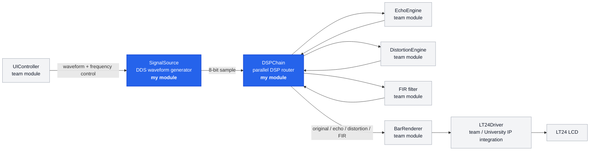
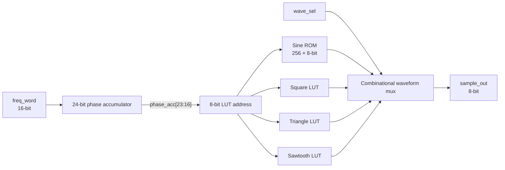
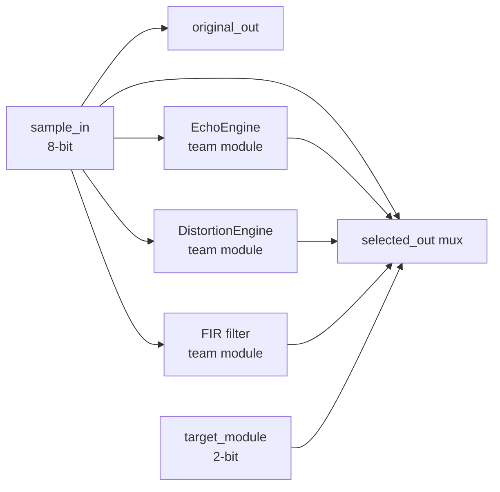

# FPGA Audio Scope Visualiser

**Individual FPGA/DSP contribution by Kennedy Chukwuma**  
**ELEC5566M — FPGA Design for System on Chip, University of Leeds**  
**Academic Year:** 2025–2026

> **Portfolio note:** This repository documents the parts of a four-person assessed group project that I personally designed, implemented or prepared. The complete assessed system is held in a private University of Leeds GitHub repository. Code written by other group members and University-provided IP are intentionally not redistributed here.

---

## Project at a Glance

The **FPGA Audio Scope Visualiser** is a real-time digital signal-processing system implemented in Verilog on a **Terasic DE1-SoC** development board using an **Intel Cyclone V FPGA** and an **LT24 LCD**.

At system level, the project:

- generates sine, square, triangle and sawtooth waveforms;
- applies echo, distortion and FIR filtering in parallel;
- visualises the original and processed signal amplitudes on the LT24 display;
- provides hardware control through switches, push-buttons, LEDs and 7-segment displays; and
- runs from a 50 MHz FPGA clock without a CPU or operating system.

My work focused on the **front end of the signal path, DSP routing, verification support, waveform-table generation, and FPGA timing/board constraints**.

**Technologies:** Verilog · FPGA · Digital Signal Processing · Direct Digital Synthesis (DDS) · Intel Quartus Prime · ModelSim · TimeQuest · Python · Tcl · DE1-SoC · Cyclone V

---

## Hardware Demonstration


*Integrated group system running on the DE1-SoC with the LT24 display. The image shows the final hardware context in which my waveform generator, DSP routing and FPGA constraints were used. The complete system also contains modules authored by other team members.*

---

## My Contribution

| Area | My work |
|---|---|
| Waveform generation | Designed `SignalSource.v`, a parameterised DDS waveform generator |
| DSP architecture | Designed `DSPChain.v`, the parallel routing and effect-selection hub |
| Verification | Developed self-checking testbenches for `SignalSource` and `DSPChain` |
| Waveform data | Wrote `Sine_LUT.py` and generated the 256-entry `sine_lut.mif` |
| Timing | Wrote `AudioScopeTop.sdc` for the 50 MHz system and I/O timing constraints |
| Board integration | Prepared `AudioScopePin_assignments.tcl` for DE1-SoC and LT24 connections, with University-provided LCD mappings clearly attributed |
| Reused IP | Integrated a `HexTo7Segment` block from an earlier ELEC5566M lab; it is not presented here as original project code |

---

## System Context

The complete group design used the following high-level signal path. **Blue blocks mark the modules I authored.** The other blocks are shown only to explain how my work fitted into the integrated system.



This public repository is therefore a **portfolio extract**, not a replacement for the complete assessed group repository.

---

# 1. `SignalSource.v` — Direct Digital Synthesis Waveform Generator

`SignalSource` produces one unsigned 8-bit waveform sample on every 50 MHz clock cycle. I used a **24-bit phase accumulator** so the output frequency can be changed by modifying a tuning word rather than changing the FPGA clock.

The module supports four selectable waveforms:

| `wave_sel` | Waveform |
|---|---|
| `00` | Sine |
| `01` | Square |
| `10` | Triangle |
| `11` | Sawtooth |

### DDS relationship

The output frequency is determined by

```text
f_out = (freq_word × f_clock) / 2^PHASE_WIDTH
```

With the project defaults:

```text
f_clock     = 50 MHz
PHASE_WIDTH = 24
frequency resolution = 50,000,000 / 2^24 ≈ 2.98 Hz per tuning-word step
```

For example, `freq_word = 1000` gives an output frequency of approximately **2.98 kHz**.

### Architecture



### Phase accumulator

```verilog
reg [PHASE_WIDTH-1:0] phase_acc;

always @(posedge clock or posedge reset) begin
    if (reset)
        phase_acc <= 0;
    else
        phase_acc <= phase_acc + freq_word;
end
```

The accumulator wraps naturally at \(2^{24}\). The upper eight bits are used as the waveform-table address:

```verilog
localparam ADDR_MSB = PHASE_WIDTH - 1;
localparam ADDR_LSB = PHASE_WIDTH - SAMPLE_WIDTH;

wire [SAMPLE_WIDTH-1:0] lut_addr =
    phase_acc[ADDR_MSB : ADDR_LSB];
```

The lower 16 bits therefore act as **fractional phase**, which is what provides frequency resolution much finer than directly stepping through a 256-sample table.

### Waveform implementation

The sawtooth, square and triangle tables are generated in the Verilog design. The sine waveform is stored as a 256 × 8-bit ROM initialised from `sine_lut.mif`.

```verilog
(* ram_init_file = "sine_lut.mif" *)
reg [SAMPLE_WIDTH-1:0] sine_lut [0:LUT_DEPTH-1];
```

The waveform is selected with a combinational multiplexer:

```verilog
always @* begin
    sample_out = {SAMPLE_WIDTH{1'b0}};

    case (wave_sel)
        2'b00: sample_out = sine_lut[lut_addr];
        2'b01: sample_out = square_lut[lut_addr];
        2'b10: sample_out = tri_lut[lut_addr];
        2'b11: sample_out = saw_lut[lut_addr];
    endcase
end
```

This keeps waveform selection independent of the phase-generation logic.

---

# 2. Python-Generated Sine ROM

Rather than manually entering 256 samples, I wrote `Sine_LUT.py` to generate the Quartus Memory Initialization File.

```python
for i in range(DEPTH):
    angle = (2 * math.pi * i) / DEPTH
    value = int(127.5 + 127.5 * math.sin(angle))
    value = max(0, min(255, value))
    f.write(f"  {i} : {value};\n")
```

The script maps a conventional sine wave from `-1 ... +1` into the unsigned 8-bit range `0 ... 255`.

Examples from the generated MIF:

| Address | Value | Meaning |
|---:|---:|---|
| 0 | 127 | mid-point |
| 64 | 255 | positive peak |
| 128 | 127 | mid-point |
| 192 | 0 | negative peak |

Keeping the generator in the repository makes the ROM data reproducible rather than treating the `.mif` file as a manually created asset.

---

# 3. `DSPChain.v` — Parallel DSP Routing Hub

My second main Verilog module was `DSPChain`, which forms the connection between the waveform generator and the group's DSP effect modules.

The design sends the same `sample_in` to three effect paths:

- echo;
- distortion; and
- FIR filtering.

It also preserves the unprocessed input as `original_out`.



### Why I used parallel routing

The architecture deliberately keeps every effect path active instead of processing only the currently selected effect.

That decision matters for this project because the display visualises multiple signal paths at the same time. It also demonstrates a key FPGA design advantage: independent hardware blocks can operate **concurrently**, rather than waiting for a sequential software loop.

The original signal remains permanently available:

```verilog
assign original_out = sample_in;
```

The selected path is controlled by a purely combinational multiplexer:

```verilog
always @* begin
    selected_out = sample_in;

    case (target_module)
        2'b00: selected_out = sample_in;
        2'b01: selected_out = echo_out;
        2'b10: selected_out = dist_out;
        2'b11: selected_out = fir_out;
    endcase
end
```

The effect engines themselves were authored by other members of the group and are **not redistributed in this portfolio repository**.

---

# 4. Verification Approach

I developed self-checking Verilog testbenches rather than relying only on waveform inspection.

## `SignalSource_tb.v`

The testbench exercises:

- reset behaviour;
- square-wave output at LUT address 0;
- triangle-wave output at LUT address 0;
- deterministic DDS phase advancement using a known tuning word;
- mid-operation reset; and
- switching among waveform selections.

A useful DDS test uses `freq_word = 1024`.

Because

```text
64 × 1024 = 65,536 = 2^16
```

and `lut_addr = phase_acc[23:16]`, the sawtooth LUT address advances by exactly one after 64 clock cycles. That gives the testbench a deterministic expected value rather than relying on visual inspection.

## `DSPChain_tb.v`

The DSP routing testbench was designed to cover:

- original pass-through;
- echo-path selection;
- distortion clipping;
- FIR-path selection;
- independence of `original_out`;
- valid 8-bit output ranges;
- immediate combinational path switching; and
- reset behaviour of the integrated echo path.

Because `DSPChain` instantiates effect engines authored by other group members, running this testbench outside the original private project also requires compatible implementations of those dependency modules.

> **Repository boundary:** The testbenches are included as evidence of my verification methodology. This portfolio does not redistribute teammates' effect-engine source files.

---

# 5. Timing Constraints — `AudioScopeTop.sdc`

I prepared the TimeQuest constraints used to describe the 50 MHz design clock and external I/O timing.

The primary clock is defined as:

```tcl
create_clock -name "CLOCK_50" -period 20.000ns [get_ports {CLOCK_50}]
```

I also specified input delays for the slide switches and push-buttons and output delays for the LEDs and 7-segment displays.

```tcl
set_input_delay  -clock "CLOCK_50" -max 3.0 [get_ports {SW[*]}]
set_input_delay  -clock "CLOCK_50" -min 0.5 [get_ports {SW[*]}]

set_output_delay -clock "CLOCK_50" -max 3.0 [get_ports {LEDR[*]}]
```

The file additionally describes the relationship between the 50 MHz source clock and the clock used inside the LT24 display hierarchy.

The purpose of the SDC file is to make the target clock period explicit to TimeQuest so setup/hold analysis is performed against the intended operating frequency rather than leaving the FPGA design unconstrained.

---

# 6. DE1-SoC Pin Assignment Script

`AudioScopePin_assignments.tcl` collects the physical FPGA pin assignments required by the integrated system.

It covers:

- `CLOCK_50`;
- four push-buttons;
- ten slide switches;
- ten red LEDs;
- four 7-segment displays; and
- the LT24 LCD interface.

Example:

```tcl
set_location_assignment PIN_AF14 -to CLOCK_50

set_location_assignment PIN_AB12 -to "SW[0]"
set_location_assignment PIN_AC12 -to "SW[1]"

set_location_assignment PIN_V16  -to "LEDR[0]"
set_location_assignment PIN_W16  -to "LEDR[1]"
```

The board pin mappings were prepared from the **Terasic DE1-SoC User Manual**. LT24 LCD pin locations in the script were based on the class-provided `set_LCD_pin_locs.tcl` resource and are identified as such in the source file.

This distinction is important: the configuration script is part of my integration work, but I do not claim the University-provided LT24 pin mapping as original IP.

---

# 7. Hardware and Full-System Outcome

The complete group system was integrated on:

- **Terasic DE1-SoC**
- **Intel Cyclone V `5CSEMA5F31C6`**
- **Terasic LT24 240 × 320 RGB565 LCD**
- **50 MHz system clock**

At full-system integration level, the project documentation records successful FPGA compilation, generation of the programming file, timing closure at 50 MHz and on-board operation of the visualiser.

The final system displayed four live signal paths and allowed the user to change waveform/effect parameters from the DE1-SoC controls.

Those results belong to the **group project as a whole**. My individual contribution to reaching them was the waveform-generation subsystem, DSP routing module, verification support, sine-ROM generation, and timing/pin configuration described in this repository.

---

# 8. Repository Structure

Recommended public repository layout:

```text
.
├── README.md
├── src/
│   ├── SignalSource.v
│   └── DSPChain.v
├── verification/
│   ├── SignalSource_tb.v
│   └── DSPChain_tb.v
├── tools/
│   └── Sine_LUT.py
├── data/
│   └── sine_lut.mif
├── constraints/
│   ├── AudioScopeTop.sdc
│   └── AudioScopePin_assignments.tcl
└── docs/
    └── hardware-test.jpg
```

### Intentionally excluded

The following belong to the wider group/university design and are not presented as my code:

```text
EchoEngine
DistortionEngine
FIR filter
UIController
BarRenderer
LT24Driver
AudioScopeTop
LT24Display University IP
```

`HexTo7Segment.v` was reused from an earlier ELEC5566M laboratory exercise and should remain clearly identified as reused coursework IP rather than an original mini-project contribution.

---

# 9. Reproducibility and Scope

`SignalSource.v`, `Sine_LUT.py` and `sine_lut.mif` form the most self-contained part of this portfolio.

`DSPChain.v` is intentionally an **integration module**. It instantiates effect engines from the complete group project, so it cannot reproduce the full visualiser by itself without compatible implementations of those interfaces.

This is deliberate: the aim of this repository is to make my engineering contribution inspectable while respecting the ownership boundaries of a collaborative university project.

---

# 10. Engineering Skills Demonstrated

This project gave me practical experience in:

- parameterised Verilog RTL design;
- Direct Digital Synthesis;
- phase-accumulator and lookup-table architectures;
- parallel FPGA datapaths;
- combinational and sequential logic separation;
- modular RTL integration using named ports;
- self-checking HDL testbenches;
- FPGA memory initialisation;
- Python-based generation of hardware data files;
- TimeQuest timing constraints;
- FPGA I/O pin assignment with Tcl;
- Intel Quartus / ModelSim workflows;
- hardware debugging on the DE1-SoC; and
- collaborative Git/GitHub development in a multi-branch project.

---

## Attribution

This work formed part of the **ELEC5566M: FPGA Design for System on Chip** mini-project at the **University of Leeds**.

The complete Audio Scope Visualiser was a four-person group project. This public portfolio repository is intentionally limited to my individual contribution and supporting evidence.

Where a file depends on, references, or derives configuration information from University resources or another team member's module, that dependency is stated explicitly. No authorship of other contributors' source code is claimed.

---

## Author

**Kennedy Chukwuma**  
MSc project portfolio · University of Leeds
